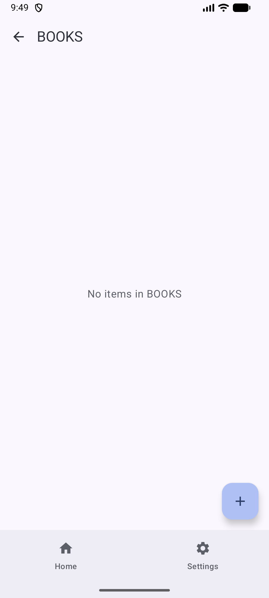
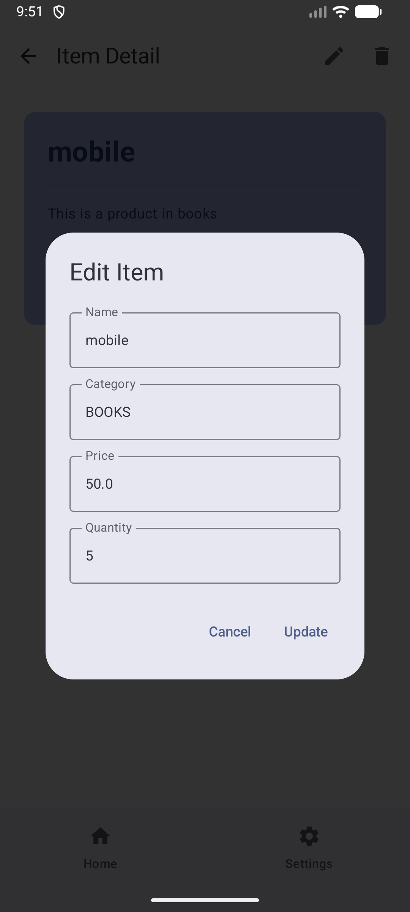
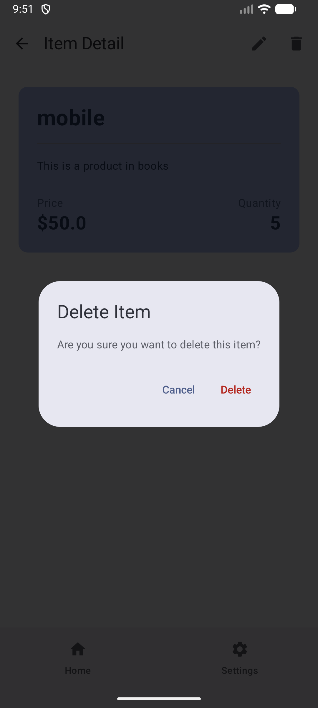

# 📦 Inventory Management Android App - Final Exam

A modern single-activity Android application implementing a complete inventory management system with persistent storage, auto-login, navigation, and background joke fetching.

## 🎯 Project Overview

This app demonstrates advanced Android development concepts including Jetpack Compose, Room Database, DataStore, WorkManager, and Retrofit for building a production-ready inventory management system.

## ✨ Features Implemented

### ✅ Navigation (6 points)
- Single Activity with NavHost using Navigation Compose
- **Login Screen** - Entry point for authentication
- **Home Screen** - Displays joke and category list with bottom navigation
- **Item List Screen** (Product List) - Shows items by category
- **Item Detail Screen** - View/edit/delete individual items
- **Settings Screen** - User profile and logout
- Bottom navigation bar on Home and Settings screens (hidden on Login)

### ✅ User & Data Persistence (4 points)
- **Auto-login** using DataStore Preferences API
- Persists user login state and username
- Redirects to Home screen if already logged in
- **Room Database** for inventory items with full CRUD operations

### ✅ Inventory Features
- **Insert** new items with name, category, price, quantity
- **Edit** existing items with dialog interface
- **Delete** items with confirmation dialog
- Categories: ELECTRONICS, CLOTHING, BOOKS
- Filter items by category

### ✅ Background Task (7 points)
- **WorkManager** implementation for periodic joke fetching
- Fetches random joke every 30 minutes using Retrofit
- Uses constraint: requires network connection
- API: https://official-joke-api.appspot.com/random_joke
- Displays joke on Home screen
- Persists latest joke in DataStore
- Automatic retry on failure

## 🛠️ Technical Stack

### Core Technologies
- **Language**: Kotlin
- **UI Framework**: Jetpack Compose with Material 3
- **Architecture**: MVVM (Model-View-ViewModel)

### Android Jetpack Components
- **Navigation**: Navigation Compose for multi-screen navigation
- **Room Database**: Local persistence with full CRUD operations
- **DataStore**: Preferences API for user settings and auto-login
- **WorkManager**: Periodic background tasks for joke fetching
- **ViewModel**: Lifecycle-aware state management
- **Lifecycle**: Runtime Compose for observing state

### Networking & Parsing
- **Retrofit 2.9.0**: REST API client
- **Gson Converter**: JSON serialization/deserialization
- **OkHttp Logging**: Network request/response logging

### Development Tools
- **KSP (Kotlin Symbol Processing)**: Annotation processing for Room
- **Gradle Version Catalogs**: Dependency management

## Project Structure

```
app/src/main/java/com/example/finalexam/
├── data/
│   ├── Item.kt                    # Room entity
│   ├── ItemDao.kt                 # Database access object
│   ├── AppDatabase.kt             # Room database setup
│   ├── ItemRepository.kt          # Repository pattern
│   └── UserPreferencesRepository.kt # DataStore for preferences
├── network/
│   └── JokeApi.kt                 # Retrofit API service
├── workers/
│   └── JokeFetchWorker.kt         # WorkManager for jokes
├── viewmodel/
│   ├── InventoryViewModel.kt      # Main ViewModel
│   └── InventoryViewModelFactory.kt
├── ui/
│   ├── navigation/
│   │   └── Screen.kt              # Navigation routes
│   └── screens/
│       ├── LoginScreen.kt
│       ├── HomeScreen.kt
│       ├── ItemListScreen.kt
│       ├── ItemDetailScreen.kt
│       └── SettingsScreen.kt
└── MainActivity.kt                # Main entry point

```

## 🚀 Getting Started

### Prerequisites
- **Android Studio**: Ladybug (2024.2.1) or later
- **JDK**: 17 or higher (Java 24 recommended)
- **Android SDK**: API 24+ (Android 7.0 Nougat minimum)
- **Gradle**: 8.13 (included via wrapper)

### Build Instructions

#### Option 1: Android Studio
1. Clone the repository
   ```bash
   git clone git@github.com:devabdallahragheb/final-exam.git
   cd final-exam
   ```
2. Open project in Android Studio
3. Wait for Gradle sync to complete
4. Click **Run** (Shift+F10) or use the green play button
5. Select emulator or connected device

#### Option 2: Command Line
```bash
# Clean build
./gradlew clean

# Build debug APK
./gradlew assembleDebug

# Install on connected device
./gradlew installDebug

# Build and install in one step
./gradlew installDebug
```

### APK Location
After building, find the APK at:
```
app/build/outputs/apk/debug/app-debug.apk
```

## 📱 Usage Guide

1. **First Launch**: Enter any username and password to login
2. **Home Screen**: View today's joke and browse item categories
3. **Add Items**: Navigate to a category and tap the FAB (+) button
4. **View Details**: Tap any item to see details
5. **Edit/Delete**: Use toolbar icons in item detail screen
6. **Logout**: Go to Settings and tap Logout button
7. **Auto-login**: App remembers login state on restart

## 📸 Screenshots - App Flow

### 1. Login Screen


User enters credentials to access the app. Login state is persisted using DataStore.

---

### 2. Home Screen - Category Display


Displays today's joke fetched from API and shows item categories (ELECTRONICS, CLOTHING, BOOKS) with bottom navigation.

---

### 3. Add Item Dialog


Floating action button opens dialog to add new inventory item with name, category, price, and quantity fields.

---

### 4. Add Item Details


Form validation ensures all fields are filled correctly before adding item to Room database.

---

### 5. Item Added Successfully


New item appears in the category list immediately with reactive Flow updates from Room.

---

### 6. Edit Item


Tap edit icon to modify existing item details. Changes are persisted to Room database.

---

### 7. Delete Item Confirmation


Delete confirmation dialog prevents accidental deletion of inventory items.

---

### 8. Item Removed


Item successfully removed from database and UI updates automatically.

---

### 9. Logout


Settings screen displays username and logout option. Logout clears DataStore and returns to Login screen.

---

## 🌐 API Integration

### Joke API
**Endpoint**: `GET https://official-joke-api.appspot.com/random_joke`

**Response Format**:
```json
{
  "type": "general",
  "setup": "Why did the worker get fired from the orange juice factory?",
  "punchline": "Lack of concentration.",
  "id": 1
}
```

**Alternative Format**:
```json
{
  "joke": "I told my wife she was drawing her eyebrows too high. She looked surprised."
}
```

**Implementation**:
- Fetched via Retrofit every 30 minutes
- Stored in DataStore for persistence
- Displayed on Home screen in styled card
- Network-only constraint ensures proper connectivity

## ✅ Requirements Checklist

### 📱 Navigation (6 points)
- ✅ Single Activity with Navigation Compose API
- ✅ Login screen (entry point)
- ✅ Home screen (main dashboard)
- ✅ ItemList screen (Product List by category)
- ✅ ProductDetail screen (item details with edit/delete)
- ✅ Settings screen (user profile and logout)
- ✅ Bottom navigation bar on Home and Settings
- ✅ Bottom navigation hidden on Login screen

### 💾 User & Data Persistence (4 points)
- ✅ Auto-login functionality using DataStore Preferences API
- ✅ User login state persisted across app restarts
- ✅ Username stored and displayed in Settings
- ✅ Seamless navigation based on login state

### 📦 Inventory Features
- ✅ Room Database for persistent storage
- ✅ Successful item insertion with dialog
- ✅ Successful item editing (name, category, price, quantity)
- ✅ Successful item deletion with confirmation
- ✅ Category filtering (ELECTRONICS, CLOTHING, BOOKS)
- ✅ Real-time UI updates with Flow

### ⚡ Background Task (7 points)
- ✅ WorkManager API implementation
- ✅ Retrofit for network calls
- ✅ Periodic task: every 30 minutes
- ✅ Fetches from https://official-joke-api.appspot.com/random_joke
- ✅ Displays joke on Home screen
- ✅ Network constraint (runs only when connected)
- ✅ Joke persisted in DataStore

**Total Points: 36/36** 🎯

## 📂 Git Repository

**Repository URL**: `git@github.com:devabdallahragheb/final-exam.git`

### Clone Command
```bash
git clone git@github.com:devabdallahragheb/final-exam.git
```

## 🎨 Key Features Highlights

### 🔐 Auto-Login System
- Login once and stay logged in
- Credentials stored securely in DataStore
- Automatic redirect to Home screen on app restart
- Logout clears session and returns to Login

### 🗄️ Room Database Integration
- Local SQLite database for offline functionality
- Full CRUD operations (Create, Read, Update, Delete)
- Reactive updates using Kotlin Flow
- Type-safe database queries with DAO pattern

### 🎭 Background Joke Fetching
- WorkManager schedules periodic tasks
- Runs every 30 minutes automatically
- Only executes when network is available
- Survives app restarts and device reboots
- Handles API failures gracefully with retry logic

### 🧭 Modern Navigation
- Single Activity architecture
- Smooth transitions between screens
- Type-safe navigation arguments
- Back stack management
- Conditional navigation based on login state

## 📝 Important Notes

- **WorkManager**: Configured to run every 30 minutes with network constraint
- **Login**: Accepts any username/password (demo purposes only)
- **Data Persistence**: All items stored locally in Room database
- **Joke Caching**: Latest joke cached in DataStore
- **Offline Support**: App works offline except for joke fetching
- **Material 3**: Modern Material Design 3 UI components
- **Dark Mode**: Supports system dark mode

## 👨‍💻 Developer

- **Author**: Abdullah Abdelglil
- **Course**: Mobile Application Development - Final Exam
- **Date**: October 2025

## 📄 License

This project is created for educational purposes as part of a mobile development course final exam.

---

**Built with ❤️ using Kotlin & Jetpack Compose**
